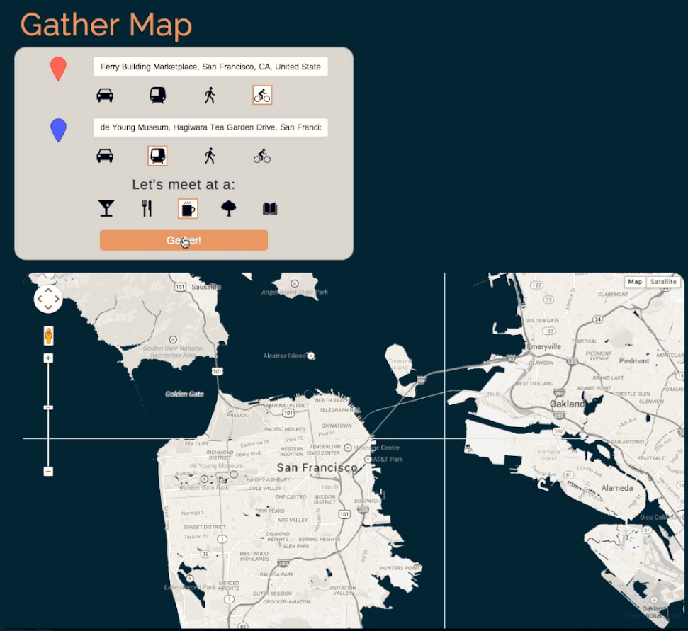
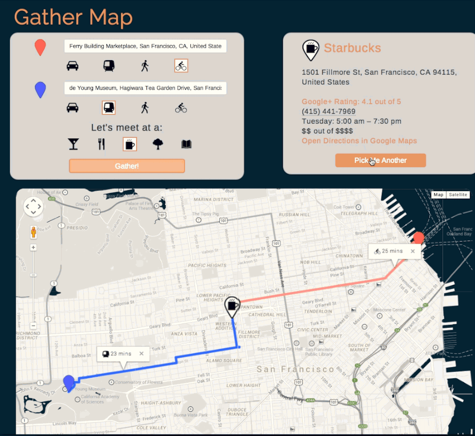

Gather Map
=========
###### Let's Meet in the Middle.

<strong>Web app that chooses a spot between two locations that is equi-time between them.</strong>

Have you ever had trouble deciding where you and a friend should meet up for coffee when time is of the essence? Or have you ever been in an unfamiliar city and wondered where's the best spot for you to grab lunch with someone on the other side of the city? Worry no longer, because gather map has you covered. 

Users can specify two origin locations, transportation methods used, and desired type of location (bar, restaurant, café, etc).

Gather map then returns the best spot for the two people to meet at, so that they both spend the same time getting there. There is also a box with information about that business: phone number, address, hours, rating, and price level. A map then displays directions from each origin address to the 'gathering point' business and displays the estimated travel time for each user. There's also a link to open directions in either the Google Maps app (if the user is on a mobile device) or on maps.google.com.

Users can then ask for a different spot nearby, if they do not want to meet at that particular establishment. The business info and map then reload with new information. 

###### Stack:

*	Python
*	Flask
*	Jinja
*	Javascript
*	Jquery
*	Promises (Q library)
*	HTML/CSS
*	Bootstrap
*	Google Maps APIs: JS Embed, Distance Matrix, Autocomplete, Places Nearby, Directions

###### Getting started:

1) First, clone this directory to your computer.

<pre><code>$ git clone https://github.com/savannahjune/gather.git</code></pre>

2) Create and activate a virtual environment in the same directory on your computer.

<pre><code>$ pip install virtualenv
$ virtualenv env
$ source env/bin/activate 
</code></pre>

3) Install all required packages using pip.

<pre><code>(env)$ pip install -r requirements.txt
</code></pre>

4) Then run python app.py from the gather directory in terminal on your computer and you'll be ready to go!

###### File structure:

<strong>static</strong>
- assets: all images used in project
- css: style formatting, personal is custom.css, all other files are bootstrap
- fonts: fonts included in bootstrap
- js
	- bootstrap.js and bootstrap.min.js: javascript included in bootstrap 
	- jquery.autocomplete.js: used in address autocompletion 
	- main.js: main JS file 
	- oldmap.js: JS file that shows two maps instead of one 
	- typeahead.bundle.js: used for typeahead autocompletion 

<strong>templates</strong>: main.html: single page app, so a single HTML template for the app

<strong>.gitignore</strong>: file used to ignore local virtual environment

<strong>Procfile</strong>: needed for heroku deployment

<strong>README.md</strong>: what you're currently reading

<strong>app.py</strong>: flask app python script

<strong>requirements.txt</strong>: list of required modules for installation

###### Walk Through:

When a user first visits gathermap.com, they must first specify the two locations they and their friend are coming from. This input uses typeahead.js and Google Maps Autocomplete API to predict the user's address as they type. Then users specify which type of transportation they'll be using and their friend will be using to meet up.  Users can choose to drive, use public transit, walk, or bike. Finally, they click to choose which type of location they'd like to meet at: bar, restaurant, café, park, or library. Then they click "Gather!" and the app begins choosing a location for their meeting based on their inputs.

Next, gather map grabs the addresses from the form and geocodes them into latitude and longitude coordinates using the Google Maps Geocoder API. Then these coordinates are passed to a function that finds the geographical midpoint between the two coordinates. Then the app is ready to find the gathering point between these two locations. 

###### Finding the Gathering Point:

Using the geographical midpoint, initialMid, as a starting point, findGatheringPoint calls the calculateDuration function between each starting point and the initialMid taking into account the type of transportation that user is utilizing. The calculateDuration function uses the Google Maps Distance Matrix API for walking, biking, and driving, as it can factor in traffic into its queries, but it does not allow for transit queries.  For transit, calculateDuration uses the Google Maps Directions API. 

Next, it compares the travel time of person one (durationOne) to the travel time of person two (durationTwo).  Using a binary search, the initialMid is reset between either the first location and initialMid if the travel time for person one is greater than the travel time of person two, or between the initialMid and person two's location if their travel time is greater.  Sometimes the two durations are within the defined tolerance (5% difference allowed) right away, but if not this binary search continues until the durations are within the tolerance or more than ten attempts have been made. This is to maximize speed without sacrificing accuracy. Most queries require about five to seven attempts to reach the tolerance.

<pre><code>
/**
 *  Finds best gathering point between two places, as far as time to reach a midpoint
 *  
 *  @param {pointOne} integer, must be in coordinate form for math, first location
 *  @param {pointTwo} integer, must be in coordinate form for math, second location
 *  @param {initialMid} integer, coordinate, initial midpoint that is redefined in this recursive function
 *  @param {methodTransportOne} string, taken from form, method of transport for first user
 *  @param {methodTransportTwo} string, taken from form, method of transport for second user
 *  @return {gatheringPoint} most optimal place for two people to meet, spend equal amounts of time getting there
 */

function findGatheringPoint(pointOne, pointTwo, initialMid, methodTransportOne, methodTransportTwo) {
    numAttempts++;
    var deferred = Q.defer();

    return calculateDuration(initialPointOne, initialMid, methodTransportOne)
    // calculates duration between the first point and initial mid (reset in recursive function)
    .then(function(durationOne) {
        return calculateDuration(initialPointTwo, initialMid, methodTransportTwo)
        // calculates duration between the first point and initial mid (reset in recursive function)
               .then(function(durationTwo) {
                // after both durations have been found, returns them
                    return [durationOne, durationTwo];
               });
    })
    .spread(function(durationOne, durationTwo) {
        // Pulls apart the two durations for comparison
        var tolerance = 0.05 * ((durationOne + durationTwo) / 2);
        if ((Math.abs(durationOne - durationTwo) <= tolerance) || numAttempts >= maxAttempts) {
            if (numAttempts >= maxAttempts) {
                console.log("Stopped findGatheringPoint after max attempts reached");
            }
            // if the coordinate meets all requirements, then use it as gathering point
            deferred.resolve(initialMid);
            return deferred.promise;

        /**
         * the else if and else below constitute the binary search tree
         * that this algorithm uses to find optimal midpoint between two people
         */
        }
        else if (durationOne > durationTwo) {
            /** if duration one is greater, move initialMid to between initialMid and pointOne
             * by passing it into findMidPoint
             */
            newMidpoint = findMidPoint(pointOne, initialMid);
            return findGatheringPoint(pointOne, initialMid, newMidpoint, methodTransportOne, methodTransportTwo);
        }
        else {
            /** if duration two is greater, move initialMid to between initialMid and pointTwo
             * by passing it into findMidPoint
             */
            newMidpoint = findMidPoint(pointTwo, initialMid);
            return findGatheringPoint(initialMid, pointTwo, newMidpoint, methodTransportOne, methodTransportTwo);
        }

    })
    .catch(function (error) {
        console.log("findGatheringPoint Error: " + error);
    });

}
</code></pre>

Here's the console showing the findGatheringPoint algorithm in action:

###### Displaying Place Info and Map:

Once the gathering point is found, a call is made to the Google Maps Place Search API to find 
a spot nearby that matches the type of location that user specified. (If that type of location is not found, the map displays the gatheringPoint and directions to it from each origin point, with the disclaimer that no exact location was found the in the area.) Once a spot is found, the Google Maps Place ID is passed to the displayPlaceInfo function, which displays info about the location on the right hand side of the screen.

As the location info displays on the right side of the screen, the map below displays the route from each origin point to the business. This map is created by grabbing polylines for each route from the Google Directions API and then passing them to the map on screen, along with each origin point and the chosen gathering location.  

###### Choosing Another Place:

You'll notice that in the example above, Starbucks was the first result displayed to users. If the users would prefer not to go to Starbucks, they can simply click "Pick Me Another" and the next result is displayed on the screen, by accessing the next item in the nearby businesses array. The placeID of the next busienss is then sent to the displayPlaceInfo to update the location's info and the map refreshes as well with new polylines and a new gathering point.  The user can keep requesting new locations until the Google Places API runs out of responses, then the "Pick Me Another" button disappears and the users must start another gather query if they would like other results. 

###### Promises:

As you may have noticed, this project requires a lot of Google Maps API calls of all sorts, and these API calls are all asynchronous.  As the project developed, the main.js filed started to resemble <a href="http://callbackhell.com/">"callback hell"</a>. Thus, I decided to use Promises, specifically the <a href="https://github.com/kriskowal/q">Q library</a>.  

There is a main promise chain that forms the backbone of main.js. This main chain ensures that no function begins before the previous function has returned a usable value (object, array, string, integer, etc.).  
<pre><code>
$(document).ready(function () {

    /** this function provides google 
    autocomplete of addresses */

    $(".typeahead").typeahead({
        minLength: 2,
        highlight: true,
    },
    {
        source: getAutocompleteSuggestions,
        displayKey: 'description',
    });

    // this creates event listener for gather button
    $("#gather_button").on('click', function(evt) {
        numAttempts = 0;
        evt.preventDefault();
        $("#gather_button").prop('disabled',true);
        $("#gather_button").text("Loading...");
        methodTransportOne = $("input:radio[name=transport_radio1]:checked").val();
        methodTransportTwo = $("input:radio[name=transport_radio2]:checked").val();
        addresses = getAddressesFromForm();
        // points is an array of values from our form inputs
        // makes coordinates from addresses
        makeCoordinates(addresses[0])
        .then(function(latLonPointOne) {
            /**
            * this function converts coordinates to addresses
            *
            * @param {latLonPointOne} <integer> coordinate
            * @return {addresses} <array> addresses, strings
            *
            */
            initialPointOne = latLonPointOne;
            return makeCoordinates(addresses[1])
            .then(function(latLonPointTwo) {
                /**
                * this function converts coordinates to addresses
                *
                * @param {latLonPointTwo} <integer> coordinate
                * @return {addresses} <array> addresses, strings
                *
                */
                initialPointTwo = latLonPointTwo;
                return [latLonPointOne, latLonPointTwo];
            });
        })
        .then(function(latlons) {
            /**
            * this function takes latlons and finds 
            * initial simple geographical midpoint between them
            * 
            * @param {latlons} <array> latitudes & longitudes
            * @return {initialMid} <integer> coordinate of geo-midpoint
            */
            latLonPointOne = latlons[0];
            latLonPointTwo = latlons[1];
            var initialMid = findMidPoint(latLonPointOne, latLonPointTwo);
            if (latLonPointOne, latLonPointTwo) {
                return findGatheringPoint(initialPointOne, initialPointTwo, initialMid, methodTransportOne, methodTransportTwo);
            } else {
                console.log("Error with latlon creation");
            }

        })
        .then(function(gatheringPoint) {
            /**
            * this is the returned function from gathering point
            *
            * @param {gatheringPoint} <integer> coordinate between two points
            * @return {businessPlaceID} <string> returns Google Maps Place ID
            *
            */
            return findBusiness(gatheringPoint);
        })
        .then(function(businessPlaceID){
            /**
            * takes returned businessPlaceID to use in displayPlaceInfo function 
            *
            * @param {businessPlaceID} <string> returned Google Maps Place ID
            * @return {businessPlaceID} <string> to be used in displayPlaceInfo function 
            *
            */
            return displayPlaceInfo(businessPlaceID);
        })
        .then(function(placeAddress){
            /**
            * takes placeAddress from displayPlaceInfo in order to pass it to
            * getRouteCoordinates
            *
            * @param {placeAddress} <string> address of a business
            * @return {placeAddress} <string>
            */
            gatheringPlaceAddress = placeAddress;
            return getRouteCoordinates(gatheringPlaceAddress, addresses[0], methodTransportOne);

        })
        .then(function(routeCoordinatesOne) {
            /**
            * takes routeCoordinatesOne from getRouteCoordinates and returns next function which 
            * gets the next set of routeCoordinates
            *
            * @param {routeCoordinatesOne} <array> array of coordinates that make up a route
            * @return 
            */
            return getRouteCoordinates(gatheringPlaceAddress, addresses[1], methodTransportTwo)
            .then(function(routeCoordinatesTwo) {
                return [routeCoordinatesOne, routeCoordinatesTwo];
            });
        })
        .then(function(routeCoordinatesArray) {
            /**
            * takes routeCoordinates, both sets from both origin points
            *
            * @param {routeCoordinates} <array> array of coordinates
            * @return {routeCoordatinesOne, calls getRouteCoordinates with placeAddress, addresses[1], methodTransportTwo}
            */
            return displayMap(routeCoordinatesArray);
        })
        .catch(function (error) {
            /**
            * catches errors in the main promises chain and console logs them
            *
            * @param {error} <string> description of error in the main promises chain
            */
            console.log("Main Chain Error: " + error);
            $("#gather_button").prop('disabled',false);
            $("#gather_button").text("Gather!");
        });
    });
});

</code></pre>

###### Acknowledgements:

The tree icon is entitled 'Tree' by Mister Pixel from The Noun Project.

The train icon is entitled 'Train' by Jamison Wieser from The Noun Project.

Thanks!

